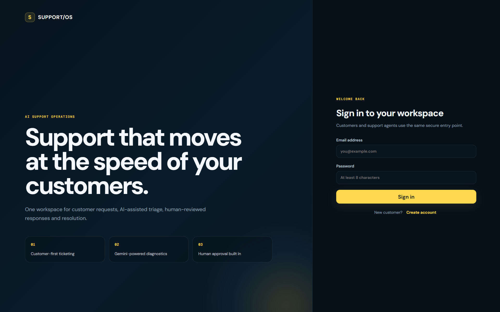
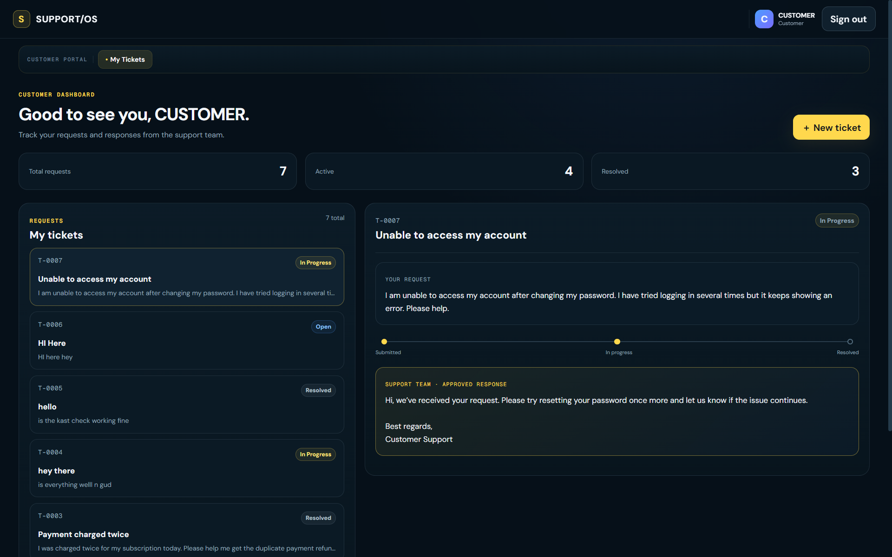
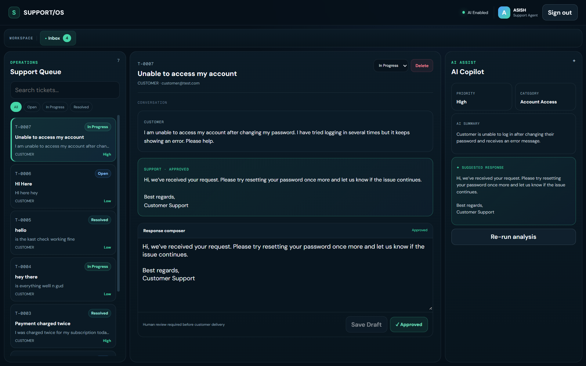

# SUPPORT/OS — AI Support Desk

SUPPORT/OS is a full-stack AI-assisted customer support platform built around a human-in-the-loop workflow.

Customers can create and track support requests, while support agents manage a centralized queue, use Gemini to analyze tickets, review and edit AI-generated response drafts, approve customer-facing replies, and move tickets through the support lifecycle.

🌐 **Live Demo:** https://ai-support-desk.pages.dev

> **Note:** The backend is hosted on Render's free tier and may take a short time to wake up after a period of inactivity.

---

## Features

### Customer Portal

- Secure customer registration and login
- Create support tickets
- Customer-isolated ticket access
- Track tickets through Open, In Progress, and Resolved states
- View support responses only after agent approval
- Dashboard statistics for total, active, and resolved requests
- Persistent ticket history across sessions

### Support Agent Workspace

- Role-protected agent dashboard
- Centralized support queue
- Search tickets by issue or customer information
- Filter tickets by status
- Update ticket lifecycle
- Review customer requests
- Edit and save response drafts
- Approve responses before customer delivery
- Delete tickets
- AI-assisted ticket diagnostics

### Gemini AI Copilot

Support agents can run AI analysis on a ticket to generate:

- Category
- Priority
- Concise issue summary
- Suggested customer response

AI output is treated as a **draft**, not an automatic customer response.

The support agent remains responsible for reviewing, editing, and explicitly approving the response before it becomes visible to the customer.

---

## Human-in-the-Loop Workflow

```text
Customer creates ticket
        ↓
Agent receives ticket
        ↓
Gemini analyzes request
        ↓
Category + Priority + Summary + Suggested Reply
        ↓
Human agent reviews / edits response
        ↓
Agent approves response
        ↓
Ticket moves to In Progress
        ↓
Customer sees approved response
        ↓
Agent resolves ticket
```

This design keeps AI in an assistive role while preserving human control over customer-facing communication.

---

## AI Safety

The Gemini system prompt includes safeguards designed to prevent unsupported claims in customer responses.

The AI is instructed not to:

- Claim that refunds, cancellations, password resets, or account changes have already been completed
- Claim access to transaction history, account data, emails, logs, databases, or other external systems
- Invent company policies, prices, timelines, or operational details
- Present a draft response as confirmation that an action has occurred

When verification or action is required, the generated response directs the issue toward human support review.

---

## Tech Stack

### Frontend

- React
- Vite
- JavaScript
- CSS
- Fetch API
- Cloudflare Pages

### Backend

- Node.js
- Express.js
- JWT authentication
- bcryptjs
- Google Gemini API (`@google/genai`)
- Render

### Database

- PostgreSQL
- Neon

---

## Architecture

```text
┌─────────────────────────────┐
│        React Frontend       │
│      Cloudflare Pages       │
└──────────────┬──────────────┘
               │ HTTPS / REST
               ▼
┌─────────────────────────────┐
│       Express REST API      │
│           Render            │
├─────────────────────────────┤
│ Authentication / RBAC       │
│ Ticket Management           │
│ Human Approval Workflow     │
│ Gemini AI Integration       │
└──────────┬───────────┬──────┘
           │           │
           ▼           ▼
┌────────────────┐  ┌────────────────┐
│ Neon           │  │ Google Gemini  │
│ PostgreSQL     │  │ AI             │
└────────────────┘  └────────────────┘
```

The Gemini API key and database credentials remain server-side and are never exposed to the browser.

---

## Authentication & Authorization

SUPPORT/OS uses JWT-based authentication with separate **Customer** and **Agent** roles.

Authorization is enforced by the backend rather than relying only on frontend routing.

Customers can access only tickets associated with their authenticated account.

Agent-only operations include:

- AI analysis
- Status management
- Response draft management
- Response approval
- Ticket deletion

Passwords are stored as bcrypt hashes.

---

## Ticket Lifecycle

```text
Open → In Progress → Resolved
```

New tickets begin in the **Open** state.

When an agent approves a customer response, an Open ticket automatically moves to **In Progress**. Agents can then mark the ticket as **Resolved** when the support process is complete.

Each ticket may also contain internal AI-generated information such as category, priority, summary, and suggested response.

These internal AI fields are available to agents but are not exposed to customers. Customers receive only an explicitly approved support response.

---

## API Overview

```text
POST   /api/auth/register
POST   /api/auth/login
GET    /api/auth/me

GET    /api/tickets
POST   /api/tickets
GET    /api/tickets/:id

POST   /api/tickets/:id/analyze
PATCH  /api/tickets/:id/status
PATCH  /api/tickets/:id/reply
PATCH  /api/tickets/:id/reply/approve
DELETE /api/tickets/:id
```

Endpoint access depends on the authenticated user's role and, for customer requests, ticket ownership.

---

## Environment Variables

Create a `.env` file inside the backend directory and configure the variables required by the deployment.

Example:

```env
DATABASE_URL=your_postgresql_connection_string
GEMINI_API_KEY=your_gemini_api_key
JWT_SECRET=your_long_random_jwt_secret

AGENT_NAME=Your Agent Name
AGENT_EMAIL=agent@example.com
AGENT_PASSWORD=your_secure_agent_password

CLIENT_ORIGIN=http://localhost:5173
```

For the frontend:

```env
VITE_API_URL=http://localhost:5000/api
```

Never commit real `.env` files, API keys, database credentials, JWT secrets, or production passwords to source control.

---

## Running Locally

### 1. Clone the repository

```bash
git clone https://github.com/akrout9999-star/ai-support-desk.git
cd ai-support-desk
```

### 2. Install backend dependencies

```bash
cd backend
npm install
```

Configure the backend environment variables, then start the API:

```bash
npm start
```

By default, the backend runs on:

```text
http://localhost:5000
```

### 3. Install frontend dependencies

Open another terminal:

```bash
cd frontend
npm install
npm run dev
```

Vite will display the local frontend URL in the terminal.

---

## Production Deployment

The production application uses separate frontend, backend, database, and AI services:

```text
Frontend  → Cloudflare Pages
Backend   → Render
Database  → Neon PostgreSQL
AI        → Google Gemini
```

Production frontend:

**https://ai-support-desk.pages.dev**

The frontend communicates with the deployed REST API through the `VITE_API_URL` environment variable.

---

## Production Validation

The frontend can be validated with:

```bash
npm run lint
npm run build
```

The deployed application has been tested through the complete workflow:

```text
Customer registration/login
        ↓
Ticket creation
        ↓
Database persistence
        ↓
Agent queue
        ↓
Gemini AI analysis
        ↓
Human review/edit
        ↓
Response approval
        ↓
Customer-visible response
        ↓
Ticket resolution
```

Ticket data persists across refreshes and authentication sessions through PostgreSQL.

---

## Security Considerations

- bcrypt password hashing
- JWT-based authentication
- Role-based API authorization
- Customer-level ticket ownership enforcement
- Agent-only administrative operations
- Parameterized PostgreSQL queries
- Server-side Gemini integration
- Environment-based secrets
- Internal AI diagnostics hidden from customers
- Human approval required before AI-assisted responses reach customers
- Production CORS configuration

---

## Screenshots

### Sign In



### Customer Portal

Customers can create support requests, monitor their status, and view approved responses from the support team.



### Agent Workspace + AI Copilot

Agents can manage the support queue, run AI diagnostics, review suggested responses, approve customer-facing replies, and resolve tickets.



---

## Future Improvements

Potential extensions include:

- Threaded customer-agent conversations
- File attachments
- Email or in-app notifications
- SLA tracking
- Support analytics
- Ticket assignment across multiple agents
- Automated testing and CI/CD validation

---

## Project Status

**Core application complete and deployed.**

SUPPORT/OS currently includes:

- Full-stack authentication
- Customer and agent roles
- Persistent PostgreSQL ticket storage
- Customer-isolated ticket access
- Agent support operations
- Gemini-powered AI analysis
- Human-reviewed AI responses
- Ticket lifecycle management
- Search and status filtering
- Loading and error states
- Production frontend and backend deployment

---

## Author

**Asish Kumar Rout**  
B.Tech — Computer Science & Engineering  
Government College of Engineering, Keonjhar

GitHub: `akrout9999-star`  
Portfolio: `asish.pages.dev`
